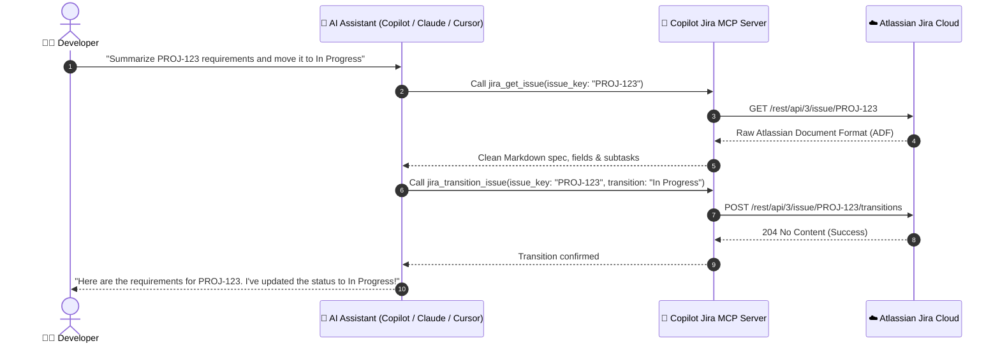

<div align="center">

# 🎫 Copilot Jira MCP Server

### *Turn your Jira into an AI-powered co-pilot.*

[](https://github.com/GiDanis/copilot-jira-mcp/stargazers)
[](https://www.npmjs.com/package/copilot-jira-mcp)
[](https://opensource.org/licenses/MIT)
[](https://nodejs.org)
[](https://modelcontextprotocol.io)

<p align="center">
  <b>Seamlessly interact with Jira issues, search JQL, read specs in Markdown, post comments, and transition tickets directly from your terminal or IDE using natural language.</b>
</p>

[Quick Start](#-10-second-quick-start) •
[Features](#-key-features) •
[Supported Clients](#-supported-clients) •
[Available Tools](#️-available-mcp-tools) •
[Examples](#-interactive-query-examples) •
[Marketing & Community](#-spread-the-word)

---

</div>

## ⚡ 10-Second Quick Start

No manual file editing required. Run the guided installer in 1 command:

### macOS / Linux
```bash
curl -fsSL https://raw.githubusercontent.com/GiDanis/copilot-jira-mcp/main/setup/install.sh | bash
```

### Windows (PowerShell)
```powershell
irm https://raw.githubusercontent.com/GiDanis/copilot-jira-mcp/main/setup/install.ps1 | iex
```

### Or using NPX (Any OS)
```bash
npx copilot-jira-mcp setup
```

The setup wizard will test your credentials and **automatically register** the server across GitHub Copilot CLI, Claude Desktop, and Cursor!

---

## 💡 Why Copilot Jira MCP?

| Without Copilot Jira MCP 😫 | With Copilot Jira MCP 🚀 |
|---|---|
| 🔀 Constantly alt-tabbing between IDE and browser | 💬 Ask your AI assistant directly in your editor |
| 📋 Manually hunting down acceptance criteria | 📝 Instant Markdown-rendered specs & subtasks |
| 🖱️ 15 clicks to move a ticket to *In Progress* | ⚡ "Move PROJ-42 to In Progress with comment..." |
| 🔎 Writing manual JQL in Jira search bars | 🧠 AI translates plain English into precise JQL |
| ⏳ Context loss during code reviews | 🔍 Pull requirements right alongside the diff |

---

## 🔄 How It Works



---

## ✨ Key Features

- 🔍 **Smart JQL Search** - Search issues via natural language or raw JQL with full pagination support
- 📝 **Native ADF ➔ Markdown Parser** - Converts Atlassian Document Format (ADF) into clean Markdown (code blocks, lists, tables, quotes, headings)
- ⚡ **Workflow Transitions** - Advance ticket statuses (e.g., *To Do* ➔ *In Progress* ➔ *Done*) with optional resolution comments
- 💬 **Comment Threads** - Read discussions and append new comments to issues
- 🆕 **Create & Update Issues** - Create new Tasks, Bugs, and Stories; edit summaries, descriptions, priorities, and labels
- 🔗 **Subtasks & Issue Links** - Inspect parent-child hierarchies and linked blocking issues
- 📁 **Project Discovery** - List all accessible Jira projects and metadata
- 👤 **My Work Overview** - Instant access to issues assigned to you
- 🔌 **1-Click Multi-Client Auto-Registration** - Configures Copilot CLI, Claude Desktop, and Cursor automatically
- 🔒 **Enterprise-Grade Security** - Credentials strictly stay in local environment variables; zero third-party telemetry

---

## 📱 Supported Clients

| Client | Status | Configuration File |
|---|:---:|---|
| **GitHub Copilot CLI** | ✅ Native | `~/.copilot/mcp.json` |
| **Claude Desktop** | ✅ Native | `claude_desktop_config.json` |
| **Cursor IDE** | ✅ Native | `~/.cursor/mcp.json` |
| **Windsurf & VS Code** | ✅ Supported | Standard MCP Stdio Configuration |
| **Antigravity / Gemini** | ✅ Supported | Local Stdio Transport |

---

## 🛠️ Available MCP Tools

Copilot Jira MCP exposes **12 comprehensive tools** spanning read, write, and workflow actions:

| Tool | Action | Description |
|---|:---:|---|
| `jira_get_issue` | 🔍 Read | Comprehensive issue details, markdown description, subtasks, links, priority |
| `jira_search_issues` | 🔍 Read | Search Jira issues using JQL syntax with pagination |
| `jira_get_my_issues` | 🔍 Read | Quick query for tickets assigned to current user, optional status filter |
| `jira_get_comments` | 🔍 Read | Retrieve discussion history with author, date, and formatted text |
| `jira_get_subtasks` | 🔍 Read | List all subtasks and child issues linked to a parent ticket |
| `jira_get_projects` | 🔍 Read | List all Jira projects accessible by authenticated account |
| `jira_get_transitions` | 🔍 Read | List valid status transitions for an issue workflow |
| `jira_whoami` | 🔍 Read | Test connection and display authenticated user details |
| `jira_create_issue` | ✏️ Write | Create new issue (Task, Bug, Story) with summary, description, priority, labels |
| `jira_update_issue` | ✏️ Write | Modify existing issue summary, description, priority, or labels |
| `jira_add_comment` | ✏️ Write | Post a new comment to an issue (plain text or markdown supported) |
| `jira_transition_issue` | ⚡ Action | Move an issue through workflow states (*In Progress*, *Done*, etc.) |

*(Legacy aliases `jira_get_ticket`, `jira_search_tickets`, and `jira_get_my_tickets` are maintained for 100% backwards compatibility).*

---

## 💬 Interactive Query Examples

Once installed, simply talk naturally to your AI:

```bash
# In Copilot CLI, Claude Desktop, or Cursor:

> "Show me my open tickets in project PROJ"
> "What are the acceptance criteria for PROJ-1234?"
> "Add a comment to PROJ-1234: 'PR #42 is up for review.'"
> "Move PROJ-1234 to 'In Progress'"
> "Create a high priority bug: 'Payment gateway timeout on checkout'"
> "List all blockers linked to PROJ-567"
> "Who am I logged in as in Jira?"
```

---

## 💻 CLI Commands

The `jira-mcp` CLI provides interactive management commands:

```bash
# Interactive dashboard (wizard, client registration, diagnostics)
npx copilot-jira-mcp

# Guided setup wizard
jira-mcp setup

# Register with all detected MCP client configs
jira-mcp register

# Test Jira credentials and print connection info
jira-mcp test

# Start server directly (used by AI clients)
jira-mcp start

# Show help
jira-mcp --help
```

---

## ⚙️ Manual Configuration

If you prefer configuring manually, set these environment variables:

```bash
export JIRA_URL="https://your-company.atlassian.net"
export JIRA_EMAIL="your-email@company.com"
export JIRA_API_TOKEN="your-atlassian-api-token"
```

Then add this block to your client config (`~/.copilot/mcp.json` or `claude_desktop_config.json`):

```json
{
  "mcpServers": {
    "jira": {
      "command": "npx",
      "args": ["-y", "copilot-jira-mcp", "start"],
      "env": {
        "JIRA_URL": "${JIRA_URL}",
        "JIRA_EMAIL": "${JIRA_EMAIL}",
        "JIRA_API_TOKEN": "${JIRA_API_TOKEN}"
      }
    }
  }
}
```

---

## 🧪 Testing & Quality Assurance

```bash
# Run unit test suite (10/10 tests pass)
npm test

# Run ESLint check
npm run lint
```

---

## 🔐 Security & Privacy

- **Zero Plaintext Storage**: Tokens are stored strictly in user-level environment variables or `.env`.
- **Zero Third-Party Relays**: Direct HTTPS communication with your Jira Cloud/Server instance.
- **`.gitignore` Enforced**: Credential files are never tracked by version control.
- See [SECURITY.md](SECURITY.md) for vulnerability disclosure.

---

## 📢 Spread the Word!

If **Copilot Jira MCP** saves you time and context-switching:

- ⭐ **Star this repository** on [GitHub](https://github.com/GiDanis/copilot-jira-mcp)
- 🐦 **Share on X / Twitter**: [Click to Tweet](https://twitter.com/intent/tweet?text=Supercharge%20your%20dev%20workflow%20with%20Copilot%20Jira%20MCP!%20Query%2C%20update%20and%20transition%20Jira%20tickets%20directly%20from%20Copilot%2C%20Claude%20%26%20Cursor%3A&url=https%3A%2F%2Fgithub.com%2FGiDanis%2Fcopilot-jira-mcp)
- 💼 **Share on LinkedIn**: Check out ready-made posts in [MARKETING.md](docs/MARKETING.md)
- 💡 **Suggest features** in [Discussions](https://github.com/GiDanis/copilot-jira-mcp/discussions)

---

## 📜 License

MIT © 2026 Giuseppe Danise — see [LICENSE](LICENSE) for details.
